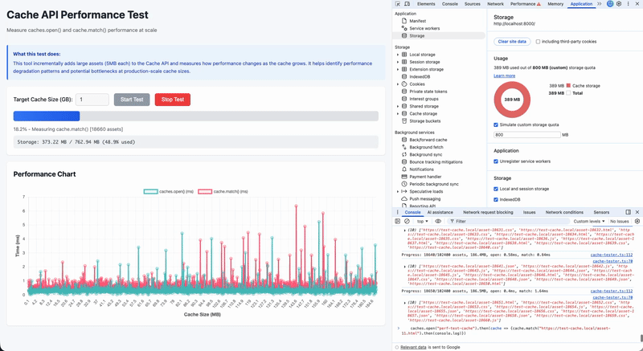

# Cache API Performance Test

A TypeScript-based performance testing tool to measure Cache API behavior under heavy load (gigabytes of data).

## Demo



Watch the tool in action: incrementally adding assets to the cache and measuring performance in real-time.

## The Test Result


The times for `cache.open` and `cache.match` appear to remain constant over time. However, the times for `Cache.put` do increase slightly as the cache fills with data.

**One notable discovery is that the very first `cache.open` call can take a significant amount of time depending on how much data the cache currently holds. The exact duration varies, but I have observed delays of up to 15 seconds when storing gigabyte of data in the cache.**

**This issue is further compounded by a bug in Chromium (tagged as "Won't fix" for security reasons) which you can read about here: https://issues.chromium.org/issues/40555289#comment18. Storing opaque responses blows blows the cache out of proportion as responses are inflated to ~7MB per request.**

This is most probably the root cause of the performance issues some of our users have been reporting.

### Further actions:

- Do not store "opaque" responses to prevent the cache from exploding in size
- Implement time-based eviction strategy on top of Cache interface to prevent unbound growth over time.

### Update:

Removing the caching of opaque responses makes the offline experience virtually useless. Without it, you end up with plain HTML, but no CSS, JavaScript, or images.

There is a way to avoid opaque responses by changing the default no-cors mode of asset requests to opt into CORS mode. To explicitly trigger a CORS request that yields a non-opaque response, you need to opt into CORS mode by adding the `crossorigin` attribute to your HTML elements. For instance:

```html
<link crossorigin="anonymous" rel="stylesheet" href="..." />

```

This needs to be applied everywhere, and all servers must be configured to provide CORS headers for all those requests. It may require some extra work, but it can be done.

---

# About the poject

## What It Does

This tool helps you understand how `caches.open()` and `cache.match()` performance degrades as the cache grows to production-scale sizes. It:

- Incrementally adds large assets (5MB each) to the Cache API
- Measures `caches.open()` and `cache.match()` timing after each increment
- Scales to gigabytes of cached data
- Displays results in a real-time updating chart
- Provides detailed performance analysis

## Quick Start

### 1. Install Dependencies

```bash
npm install
```

### 2. Build the Project

```bash
npm run build
```

### 3. Start the Server

```bash
npm run serve
```

Or use any other static file server:

```bash
python3 -m http.server 8000
```

**Note:** The server must run from the project root (not the public directory) so both `/public/` and `/dist/` are accessible.

### 4. Open in Browser

Navigate to: http://localhost:8000/public/

### 5. Run a Test

1. Enter your target cache size (e.g., 1 for 1GB)
2. Click "Start Test"
3. Watch the real-time chart updates
4. Review the summary when complete
